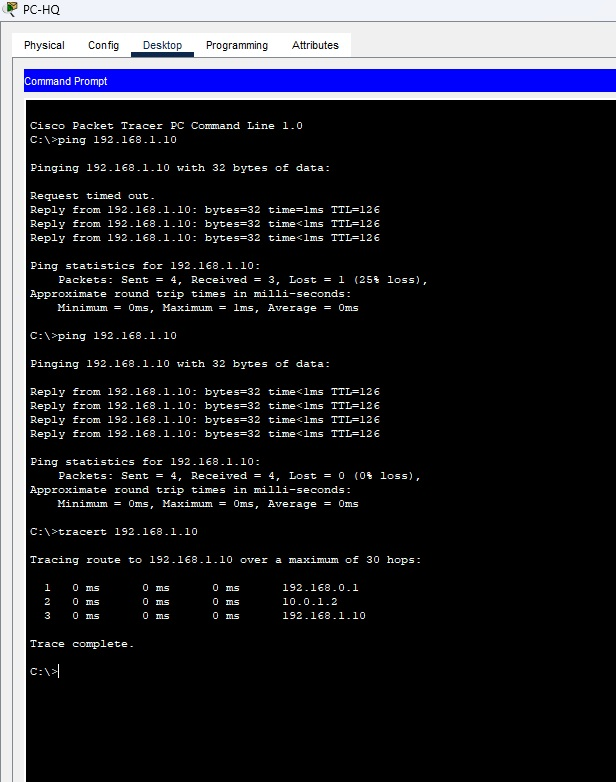

## Задание 1. 

Лабораторная работа "Выбор и настройка протокола из семейства FHRP"

Уточнение - оборудование Cisco.

Выбрать протокол из семейства FHRP и обосновать свой выбор. \
Построить топологию в Сisco Packet Tracer. \
Настроить оборудование центрального офиса и филиала. \
Проверить работу резервирования связи с филиалом. Для этого отключить основной канал, проверить командами ping и tracert доступность ПК в филиале и путь до него. \
На вопрос 1 - ответ в свободной форме, в текстовом виде. \
На вопросы 2 и 3 - приложить .pkt файл. \
На вопрос 4 - скриншоты выполнения команд ping и tracert.

## ОТВЕТ:

 Конфигурация с HSRP

Конфигурация R-HQ-Main (Центр, основной роутер - Active)

enable \
configure terminal \
hostname R-HQ-Main \
no ip domain-lookup

! Настройка интерфейса в локальную сеть с HSRP \
interface gig0/0 \
 ip address 192.168.0.1 255.255.255.0 \
 standby 1 ip 192.168.0.254 \
 standby 1 priority 150 \
 standby 1 preempt \
 standby 1 track gig0/1 30 \
 no shutdown \
 exit

! Интерфейс в основной канал \
interface gig0/1 \
 ip address 10.0.1.1 255.255.255.252 \
 no shutdown \
 exit

! OSPF для маршрутизации между офисами \
router ospf 1 \
 network 192.168.0.0 0.0.0.255 area 0 \
 network 10.0.1.0 0.0.0.3 area 0 \
 default-information originate \
 exit

! Маршрут по умолчанию (для выхода в интернет, если нужно) \
ip route 0.0.0.0 0.0.0.0 192.168.0.254 

end \
write memory 

Конфигурация R-HQ-Backup (Центр, резервный роутер - Standby) 

enable \
configure terminal \
hostname R-HQ-Backup \
no ip domain-lookup

! Настройка интерфейса в локальную сеть с HSRP
interface gig0/0 \
 ip address 192.168.0.2 255.255.255.0 \
 standby 1 ip 192.168.0.254 \
 standby 1 priority 100 \
 standby 1 preempt \
 standby 1 track gig0/1 30 \
 no shutdown \
 exit

! Интерфейс в резервный канал \
interface gig0/1 \
 ip address 10.0.2.1 255.255.255.252 \
 no shutdown \
 exit

! OSPF для маршрутизации между офисами \
router ospf 1 \
 network 192.168.0.0 0.0.0.255 area 0 \
 network 10.0.2.0 0.0.0.3 area 0 \
 default-information originate \
 exit

! Маршрут по умолчанию \
ip route 0.0.0.0 0.0.0.0 192.168.0.254

end \
write memory

Конфигурация R-Branch (Филиал) - без изменений

enable \
configure terminal \
hostname R-Branch \
no ip domain-lookup 
 
interface gig0/0 \
 ip address 192.168.1.1 255.255.255.0 \
 no shutdown \
 exit

interface gig0/1 \
 ip address 10.0.1.2 255.255.255.252 \
 no shutdown \
 exit

interface gig0/2 \
 ip address 10.0.2.2 255.255.255.252 \
 no shutdown \
 exit

! OSPF - оба канала в OSPF \
router ospf 1 \
 network 192.168.1.0 0.0.0.255 area 0 \
 network 10.0.1.0 0.0.0.3 area 0 \
 network 10.0.2.0 0.0.0.3 area 0 \
 exit

! Floating Static Route для выбора дешевого канала \
ip route 192.168.0.0 255.255.255.0 10.0.1.1 \
ip route 192.168.0.0 255.255.255.0 10.0.2.2 50

end \
write memory 

Конфигурация SW-HQ (Центральный коммутатор) - без изменений

enable \
configure terminal \
hostname SW-HQ

interface fastEthernet 0/1 \
 switchport mode access \
 exit 

interface gig0/1 \
 switchport mode access \
 exit

interface gig0/2 \
 switchport mode access \
 exit

end \
write memory \

Конфигурация SW-Branch (Коммутатор филиала) - без изменений 

enable \
configure terminal \
hostname SW-Branch

interface fastEthernet 0/1 \
 switchport mode access \
 exit 

interface gig0/1 \
 switchport mode access \
 exit

end \
write memory \

Настройка ПК (изменения только для PC-HQ)

PC-HQ:

IP Address: 192.168.0.10

Subnet Mask: 255.255.255.0

Default Gateway: 192.168.0.254 (виртуальный IP HSRP!)

PC-Branch:

IP Address: 192.168.1.10

Subnet Mask: 255.255.255.0

Default Gateway: 192.168.1.1

# Выбран протокол HSRP. Обоснование:

Обеспечивает автоматическое переключение шлюза для клиентов в офисе при отказе основного маршрутизатора.

Резервный маршрутизатор находится в режиме Standby и не передает трафик, что гарантирует минимальное использование дорогого резервного канала.

Поддерживает автоматический возврат на основной маршрутизатор при восстановлении (preempt).

Проверка состояния HSRP на центральных роутерах: show standby brief

# Отказ основного канала:

R-HQ-Main теряет связь с филиалом (отключается gig0/1).

Команда standby 1 track gig0/1 30 снижает приоритет R-HQ-Main на 30 (было 150, стало 120).

Теперь приоритет R-HQ-Backup (100) НЕ ВЫШЕ, чем у основного (120), поэтому переключения НЕ ПРОИСХОДИТ!

Чтобы произошло переключение, нужно либо:

Увеличить track до 60 (чтобы приоритет упал до 90)

ИЛИ настроить standby 1 track gig0/1 60

## Задание 2

Компания та же, но в центральном офисе добавили еще один маршрутизатор. Оборудование Cisco. Адресация для каналов Интернет:

10.1.0.0/30 \
10.2.0.0/30 \
10.3.0.0/30 

Для имитации сети Интернет можно добавить еще один маршрутизатор, к которому подключить все три канала интернет. \
На этом же маршрутизаторе создать Loopback интерфейс с адресом 10.10.10.10/32 и использовать этот адрес для проверки доступности сети Интернет.

Необходимо обеспечить компании доступ в Интернет. Непрерывно и с балансировкой по трем каналам.

Выбрать протокол из семейства FHRP и обосновать свой выбор. \
Нарисовать схему сети. \
Настроить маршрутизаторы центрального офиса в соответствии с выбранным протоколом. \
Ответы на вопрос 1 привести в свободной форме, в текстовом виде. \
На вопрос 2 - приложить файл в формате .png или .jpg. \
На вопрос 3 - привести настройки интерфейсов в текстовом виде (в синтаксисе Cisco)

# ОТВЕТ:

Схема подключения

                        ЦЕНТРАЛЬНЫЙ ОФИС (192.168.0.0/24)
                              ┌─────────────┐
                              │   PC-HQ     │
                              │  .10        │
                              │ GW: .254    │
                              └──────┬──────┘
                                     │
                              ┌──────┴──────┐
                              │   SW-HQ     │
                              └──────┬──────┘
                                     │
                    ┌────────────────┼────────────────┐
                    │                │                │
             ┌──────┴──────┐  ┌──────┴──────┐  ┌──────┴──────┐
             │  R-HQ-1     │  │  R-HQ-2     │  │  R-HQ-3     │
             │  GLBP AVG   │  │  GLBP AVF   │  │  GLBP AVF   │
             │  .1         │  │  .2         │  │  .3         │
             └──────┬──────┘  └──────┬──────┘  └──────┬──────┘
                    │                │                │
           10.1.0.0/30       10.2.0.0/30       10.3.0.0/30
                    │                │                │
                    └────────────────┼────────────────┘
                                     │
                              ┌──────┴──────┐
                              │  R-INTERNET │
                              │  (ISP)      │
                              │  Loopback0  │
                              │ 10.10.10.10 │
                              └─────────────┘
                              СЕТЬ ИНТЕРНЕТ

3. Таблица IP-адресации

Устройство	Интерфейс	IP-адрес	Маска	Примечание \
PC-HQ	NIC	192.168.0.10	255.255.255.0	Шлюз: 192.168.0.254 (GLBP) \
SW-HQ	-	-	-	Коммутатор доступа \
R-HQ-1	Gig0/0	192.168.0.1	255.255.255.0	GLBP Active Virtual Gateway (AVG) \
R-HQ-1	Gig0/1	10.1.0.1	255.255.255.252	Канал в интернет #1 \
R-HQ-2	Gig0/0	192.168.0.2	255.255.255.0	GLBP AVF \
R-HQ-2	Gig0/1	10.2.0.1	255.255.255.252	Канал в интернет #2 \
R-HQ-3	Gig0/0	192.168.0.3	255.255.255.0	GLBP AVF \
R-HQ-3	Gig0/1	10.3.0.1	255.255.255.252	Канал в интернет #3 \
R-INTERNET	Gig0/0	10.1.0.2	255.255.255.252	К R-HQ-1 \
R-INTERNET	Gig0/1	10.2.0.2	255.255.255.252	К R-HQ-2 \
R-INTERNET	Gig0/2	10.3.0.2	255.255.255.252	К R-HQ-3 \
R-INTERNET	Loopback0	10.10.10.10	255.255.255.255	Для проверки доступности \
GLBP Виртуальный IP: 192.168.0.254 (группа 1)

5. Полные конфигурации
   
Конфигурация R-HQ-1 (GLBP AVG - Active Virtual Gateway) \

enable \
configure terminal \
hostname R-HQ-1 \
no ip domain-lookup

! Настройка интерфейса в локальную сеть с GLBP \
interface gig0/0 \
 ip address 192.168.0.1 255.255.255.0 \
 glbp 1 ip 192.168.0.254 \
 glbp 1 priority 150 \
 glbp 1 preempt \
 glbp 1 load-balancing round-robin \
 glbp 1 weighting 100 \
 glbp 1 weighting track gig0/1 30 \
 no shutdown \
 exit

! Интерфейс в интернет (канал #1) \
interface gig0/1 \
 ip address 10.1.0.1 255.255.255.252 \
 no shutdown \
 exit

! Маршрут по умолчанию через интернет \
ip route 0.0.0.0 0.0.0.0 10.1.0.2

! NAT для доступа в интернет \
ip access-list standard NAT-ACL \
 permit 192.168.0.0 0.0.0.255 \
 exit

ip nat inside source list NAT-ACL interface gig0/1 overload

interface gig0/0 \
 ip nat inside \
 exit

interface gig0/1 \
 ip nat outside \
 exit

end \
write memory 

Конфигурация R-HQ-2 (GLBP AVF) 

enable \
configure terminal \
hostname R-HQ-2 \
no ip domain-lookup

interface gig0/0 \
 ip address 192.168.0.2 255.255.255.0 \
 glbp 1 ip 192.168.0.254 \
 glbp 1 priority 100 \
 glbp 1 preempt \
 glbp 1 load-balancing round-robin \
 glbp 1 weighting 100 \
 glbp 1 weighting track gig0/1 30 \
 no shutdown \
 exit

interface gig0/1 \
 ip address 10.2.0.1 255.255.255.252 \
 no shutdown \
 exit

ip route 0.0.0.0 0.0.0.0 10.2.0.2

ip access-list standard NAT-ACL \
 permit 192.168.0.0 0.0.0.255 \
 exit

ip nat inside source list NAT-ACL interface gig0/1 overload

interface gig0/0 \
 ip nat inside \
 exit

interface gig0/1 \
 ip nat outside \
 exit

end \
write memory 

Конфигурация R-HQ-3 (GLBP AVF) 

enable \
configure terminal \
hostname R-HQ-3 \
no ip domain-lookup

interface gig0/0 \
 ip address 192.168.0.3 255.255.255.0 \
 glbp 1 ip 192.168.0.254 \
 glbp 1 priority 100 \
 glbp 1 preempt \
 glbp 1 load-balancing round-robin \
 glbp 1 weighting 100 \
 glbp 1 weighting track gig0/1 30 \
 no shutdown \
 exit

interface gig0/1 \
 ip address 10.3.0.1 255.255.255.252 \
 no shutdown \
 exit

ip route 0.0.0.0 0.0.0.0 10.3.0.2

ip access-list standard NAT-ACL \
 permit 192.168.0.0 0.0.0.255 \
 exit

ip nat inside source list NAT-ACL interface gig0/1 overload

interface gig0/0 \
 ip nat inside \
 exit

interface gig0/1 \
 ip nat outside \
 exit

end \
write memory

Конфигурация R-INTERNET (Имитация провайдера)

enable \
configure terminal \
hostname R-INTERNET \
no ip domain-lookup

! Интерфейсы для подключения к трем каналам \
interface gig0/0 \
 ip address 10.1.0.2 255.255.255.252 \
 no shutdown \
 exit

interface gig0/1 \
 ip address 10.2.0.2 255.255.255.252 \
 no shutdown \
 exit

interface gig0/2 \
 ip address 10.3.0.2 255.255.255.252 \
 no shutdown \
 exit

! Loopback для имитации сервера в интернете \
interface loopback0 \
 ip address 10.10.10.10 255.255.255.255 \
 exit

! Маршруты обратно к офису (для ответа на ping) \
ip route 192.168.0.0 255.255.255.0 10.1.0.1 \
ip route 192.168.0.0 255.255.255.0 10.2.0.1 \
ip route 192.168.0.0 255.255.255.0 10.3.0.1 

end \
write memory

Конфигурация SW-HQ (без изменений)

enable \
configure terminal \
hostname SW-HQ

interface fastEthernet 0/1 \
 switchport mode access \
 exit

interface gig0/1 \
 switchport mode access \
 exit

interface gig0/2 \
 switchport mode access \
 exit

interface gig0/3 \
 switchport mode access \
 exit

end \
write memory 

Настройка PC-HQ

IP Address: 192.168.0.10

Subnet Mask: 255.255.255.0

Default Gateway: 192.168.0.254 (GLBP виртуальный IP)

# Ключевые особенности GLBP

Параметр	Описание \
Балансировка	Round-robin (по умолчанию) — равномерно распределяет трафик \
Максимум роутеров	4 в одной группе \
Время переключения	1-3 секунды (быстрее, чем HSRP) \
Отказоустойчивость	AVG и AVF автоматически перераспределяют нагрузку \
Отслеживание каналов	weighting track позволяет учитывать состояние внешних каналов \
NAT	На каждом роутере свой NAT (т.к. разные IP на внешних интерфейсах)

NAT на каждом роутере \
У каждого роутера свой внешний IP-адрес (10.1.0.1, 10.2.0.1, 10.3.0.1)

NAT настраивается индивидуально на каждом роутере

Это позволяет использовать все три канала одновременно

Маршрутизация обратно от интернета \
На R-INTERNET нужно прописать маршруты обратно к офису через все три канала

Иначе пакеты от 10.10.10.10 не смогут вернуться
